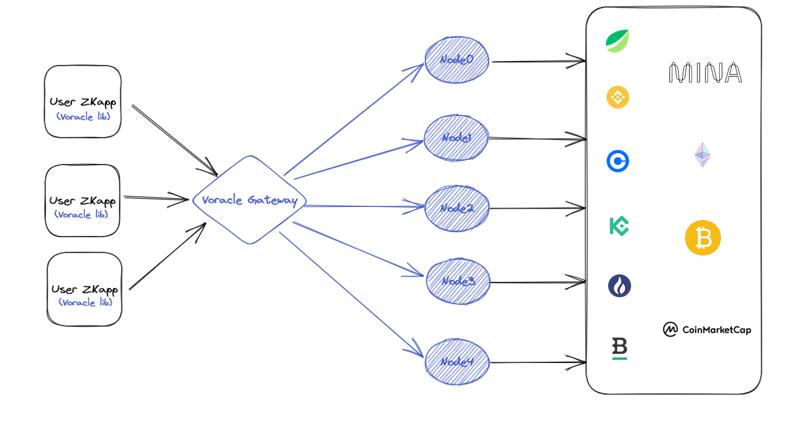

# Voracle - Verifiable Oracle Platform Based On Mina 
In various scenarios such as insurance, finance, random forecasting, and the Internet of Things, the oracle has demonstrated its irreplaceable value in the blockchain: as the tentacle of the extension of the blockchain, it has built a trusted bridge between the inside and outside of the chain, and built a mutually integrated value ecosystem.

## What is Oracle
**The mechanism by which information outside the blockchain is written into the blockchain is generally called oracle mechanism.**

The function of the oracle is to write the external information into the blockchain and complete the data exchange between the blockchain and the real world. It allows certain smart contracts to react to the uncertain external world. **It is the only way for smart contracts to interact with the outside world, and also the interface for blockchain to interact with the real world.**

To be simplified, if we compare the public chain to the operating system, and the DAPP analogy is APP, so the oracle machine can be vividly compared to the API interface (API is a set of definitions, programs and protocols, through which computer software can communicate with each other). Although this analogy is not accurate, the oracle machine plays such a role. The oracle machine is the link between the blockchain and the real world, and can be a tool for data exchange.

## Why Oracle Matters
**Blockchain is a deterministic and closed system environment.** At present, blockchain can only obtain the data inside the chain, but not the real world data outside the chain. *Blockchain is separated from the real world*.

Generally, the execution of smart contracts requires trigger conditions. When the trigger conditions of smart contracts are external information (outside the chain), a oracle machine must be required to provide data services. Real world data is input to the blockchain through the oracle machine, because smart contracts do not support external requests.

Blockchain is a deterministic environment, which does not allow uncertain things or factors. Smart contracts must be consistent whenever and wherever they run, so virtual machines (VMs) cannot allow smart contracts to have network calls, otherwise the results will be uncertain.

That is to say, the smart contract cannot perform I/O (Input/Output, that is, input/output), so it cannot actively obtain external data. It can only send data to the smart contract through a oracle machine.

The above is why the blockchain needs a oracle, because smart contracts cannot actively acquire data outside the chain, and can only passively accept data.

## Challenges of Oracle
It sounds like a oracle machine is nothing but a middleware that calls external data and returns the data to the blockchain. However, the ideal is simple and the reality is bone deep. If you think about it, you will find that there are several difficulties in the use process:
```
    How to ensure the authenticity of the external data source? 
    How to ensure the security of data during transmission and processing?
    Timeliness, cost?
    ...
```

There are many problems like this. In order to prevent these problems, the decentralized oracle needs to be carefully and comprehensively designed.

**Normal Solutions are as belows:**

##### A. Multi oracle node
In order to prevent the trust problem of single node oracle, multiple nodes are required to jointly execute the request processing of oracle data. The data inconsistency problem caused by multiple nodes requires data aggregation. Common aggregation algorithms include BFT consensus algorithm or threshold signature algorithm.
##### B. "Submission disclosure" mechanism
The data broadcasting between oracle nodes will lead to the Free loading problem, that is, a oracle does not access data sources to obtain data, but copies the answers of other oracle machines. When the nodes with empty pay account for the majority, if these nodes copy a wrong answer, it will become a majority attack, endangering the system security. We can solve this problem through the "submit expose" mechanism. The oracle node submits data answers in two stages. The answers submitted in the first stage are encrypted. All answers are decrypted after receiving enough oracle answers.
##### C. Multiple data sources or trusted single data source
The integrity of data sources is difficult to solve, because it is not a problem of oracle, but an external problem. When using the oracle machine, users should confirm that the data source they access is safe and reliable. When users access an insecure data source, the insecure data is likely to cause the oracle machine to return an incorrect result. Of course, using multiple data sources to access data can prevent a few data sources from doing evil to some extent, but this practice is not universal, because not every piece of data has multiple external data sources.
##### D. Benefit distribution
Decentralized oracle machine needs to design a set of incentive mechanism to give rewards and punishments corresponding to the behavior of oracle machine nodes. The oracle node needs to pay a certain margin when joining the decentralized network to prevent the node from doing evil. Theoretically, all the oracle machines that get the same answer as the consensus result should get the same reward, because they are all contributors to the consensus conclusion. In terms of punishment rules, we can't punish a oracle node because its answer is different from the consensus result, or it can't immediately return the request result, because we can't tell whether the oracle node is doing evil or the data source is doing evil. As for the free loading problem, once the node is found to be eating empty rates in the "disclosure submission" phase, the pledged deposit needs to be deducted in a certain proportion.

## Two Models of Oracle
At present, there are two models of oracle machine, one is a **single model**, the other is a **multiple model**, and sometimes the *multiple model* is also called Oracle network.

The *single model* only contains one oracle, which is trusted and will execute code correctly. The contract participants can be sure that it will not collude with one of the contract participants. The *single model* is similar to a software as a service provider. For most applications, a *single model* is safe enough and economical. At present, an instance of a *single model* is Oracle.

*multiple model*s include multiple oracle machines, even oracle networks. Although a single trusted oracle machine is enough for most users, high-value asset processing requires a higher degree of trust, which requires *multiple model*s. In this model, code execution is distributed among several independent oracle machines, such as 10. Set the data of these 10 oracle machines to a trusted threshold. The number of intelligent oracle machines with critical values must agree on the results. For example, if the user uses the 7/10 model, the contract can be executed only when more than seven intelligent oracle machines are consistent. This model has set aside three buffers. Maybe some intelligent oracle machines are offline, have problems or are attacked by hackers, as long as no more than three buffers do not affect the execution of contract code. *multiple model*s are more complex and costly than *single model*s, but they provide better security.

## What is Voracle
**Voracle ** is a Verifiable Oracle Platform Based On Mina, which locates between **Single Model** and **multiple model** and will go ahead forwards **multiple model** . 

Initial Stage, Voracle is still a little baby, providing basic service as below.

* External API Access Service
  * **Obtain on-chain Data like from Mina.**
  * **Obtain price data、account data from CEX like Binance.**
* VRF Service

Next Stage, Voracle will grow with further Services as below:

* Price Feed
* Automatically Trigger zkApp 
* ...

## Overview of Techical Architect

Initial Stage, Voracle Network is still a little baby, Providing common services with a Simplified Technical Architect.



Currently, Voracle **as a baby** consists of:
* **Voracle Contracts**, consisting of contracts storing all Info of current registered *Fetcher Nodes*.
* **Voracle Aggregator**, acting as API gateway for Unified entrance of All zkApps, And also as Aggregator for responses from various *Voracle Fetcher Nodes*.
* **Voracle Fetcher Nodes**,  acting as Providers within Voracle Platform, Connecting with External DataSource, and return result with their respective signature.
* **Voracle Tool**, acting as dependency providing for all zkApps looking for Oracle service from Voracle, such as invoking request to Voracle Gateway, as well as Voracle Contract Verifying data responded from each *Voracle Fetcher Nodes*.
* **Voracle UI**, consisting of Voracle website making a presentation of all Info (service quality, service status, fetcher nodes status, etc. ) of Voracle Platform. And also Integrate some interesting **zkApp for Use Cases** on the Page for showcases of Voracle.

## Integrate with Voracle
To integrate with Voracle, You first had better go to the repo belows:

* Voracle Contracts:  https://github.com/coldstar1993/Voracle/tree/main/Voracle-contract
* Voracle Aggregator:  https://github.com/coldstar1993/Voracle/tree/main/Voracle-aggregator
* Voracle Fetcher: https://github.com/coldstar1993/Voracle/tree/main/Voracle-fetcher
* Voracle Tool&Libs: https://github.com/coldstar1993/Voracle/tree/main/Voracle-tool
* Voracle ui: https://github.com/coldstar1993/Voracle/tree/main/Voracle-ui 

All You project need to do is to integrate **Voracle Tool&Libs** which provide capabilities of looking for Oracle service from Voracle, such as invoking request to **Voracle Aggregator**, as well as Voracle Contract Verifying data responded from each **Voracle Fetcher Nodes** and so on.

To be SIMPLIFIED for Mina Activity, currently **Voracle Tool&Libs** has not yet been published to public NPM repo. So, to make a dependency on it,  You could just copy the key component as a package into your project,

* You could just import the key contract--*VoracleVerifier.ts* into your files,  then compile it & leverage it!! ( UseCase Demo is *run_VoracleVerifier.ts* in [Voracle Contracts](./Voracle-contract))
* You could just import the key utility *VoralceUtil.ts* including complete api to invoke  **Voracle Aggregator** for current supported service into your files.

### use case Demo
There is a demo contract inside  **Voracle Contracts**.
[demo_checkBinanceAccount.ts](./src/demo_checkBinanceAccount.ts)

run it locally:
[run_checkBinanceAccount.ts](./src/run_checkBinanceAccount.ts)

tips: This demo will be placed with UI inside **Voracle ui**.


## How to run Voracle Locally
At the very beginning, use node:v16.13.0, which is the best.

Currently, **Voracle Contract** consists of two contracts: `Voracle` and `VoracleVerifier`, which have been deployed to `Berkeley Network`:
  * `Voracle` : `B62qjUdKdPu4aqm1jwi9Zuwi8Vm31k9sPVKiu9bwH8kS25CTg3wf3yr`
    * deployed tx: https://berkeley.minaexplorer.com/transaction/CkpZDa8mccnYWWYj3VjjsqXRMVzzjWLkAAs7Nu4Aaa5CMtnaniKK1
  * `VoracleVerifier` : `B62qmw27apC4GW9w4nze8AZy8vLSFoDq2kbVWZkP6LnnbUdTrAbf7mJ`
    * deployed tx: https://berkeley.minaexplorer.com/transaction/CkpaLRS7y82BR7TwLEqi83SRmBAwbQNmurCQhHWhUhhhjBvXKmtUu

Currently, There are fixed amount(=3) of **Voracle Fetcher**  registered into the **Voracle Contract**, which you could directly find inside the  contract file *Voracle.ts*. Therefore, During Mina Activity, You could easily boot the whole Voracle Service Locally.

The below are the key pairs respectively for each **Voracle Fetcher**
  ```
  EKF9DU363vSSFnp2reh3EeeQYPJBbVWhtU11WxtKpMpf55jPZ3hN
  B62qikWxvd7g3smTA6vDEPqeXDnP6LnxU46gKFmB9rdC8ohdnPu1AoL
  --------------
  EKEyRQWVRPKLcafRzNMvbfUTDSRowXii8xUTCkc9839X1MUqNA81
  B62qk522nBpiyG8sowkEbao2csaGm6PBtTUwSSLxkg6QTRfVDjG5xdg
  --------------
  EKFTVCvBQKqBd5vGwpqCGyPUEBq6gnrLPYeGDLHAtRdRB8fm2LFL
  B62qooLE6R54n9vBkqf5N2w4kzB3ZSvGRXcXATXnX86kpiFp7jCDd7r
  ```
, and the key pairs are respectively configured as Env:`FETCHER_PRIV_KEY` into the Boot Command inside *[package.json](./Voracle-fetcher/package.json)* within **Voracle Fetcher**
  ```
    "dev:start-fetcher0": "cross-env NODE_ENV=development SERVER_PORT=3000 FETCHER_PUB_KEY_IDX=0 FETCHER_PRIV_KEY=EKF9DU363vSSFnp2reh3EeeQYPJBbVWhtU11WxtKpMpf55jPZ3hN nodemon --watch build --delay 2500ms --experimental-specifier-resolution=node ./build/src/app.js ",

    "dev:start-fetcher1": "cross-env NODE_ENV=development SERVER_PORT=3001 FETCHER_PUB_KEY_IDX=1 FETCHER_PRIV_KEY=EKEyRQWVRPKLcafRzNMvbfUTDSRowXii8xUTCkc9839X1MUqNA81 nodemon --watch build --delay 2500ms --experimental-specifier-resolution=node ./build/src/app.js ",

    "dev:start-fetcher2": "cross-env NODE_ENV=development SERVER_PORT=3002 FETCHER_PUB_KEY_IDX=2 FETCHER_PRIV_KEY=EKFTVCvBQKqBd5vGwpqCGyPUEBq6gnrLPYeGDLHAtRdRB8fm2LFL nodemon --watch build --delay 2500ms --experimental-specifier-resolution=node ./build/src/app.js ",

  ```

So to run the whole *baby* Voracle,  steps are as belows:
  * download this repo to local disk, and `npm install` respectively.
  * step into **Voracle Fetcher** && **Voracle Aggregator**,run as below:
    * `npm run dev`

Now, 3 **Voracle Fetcher** and one **Voracle Aggregator** start locally at different ports!

`During runtime, **Voracle Aggregator** will forwards zkapp's data requests to 3 **Voracle Fetcher**.`

You could see all the endpoints supported at Swagger UI:
  * **Voracle Aggregator**:   http://localhost:8080/docs
  * **Voracle Fetcher - 0**:  http://localhost:3000/docs
  * **Voracle Fetcher - 1**:  http://localhost:3001/docs
  * **Voracle Fetcher - 2**:  http://localhost:3002/docs


And then, step into **Voracle-ui** depending on **Voracle-tool** insides and consisting of serveral zkapps for use cases, run `yarn`&`yarn start`, it will start at port 80.

Here, The whole `baby` Voracle is working!!

## The RoadMap of Voracle
* support graphQL endpoint for richer api service
* dynamically register & demise fetcher nodes.
* tokens for staking & fee
* become an Oracle NETWORK


 